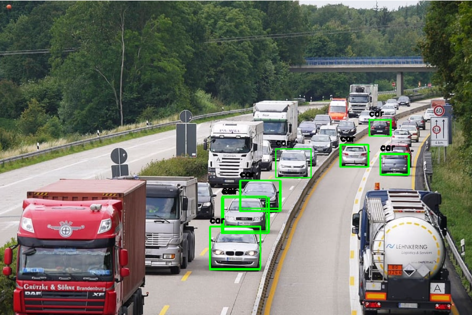
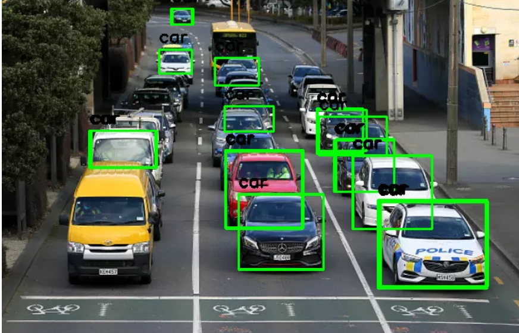
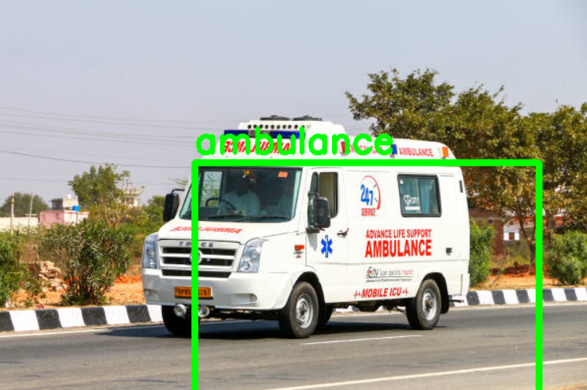
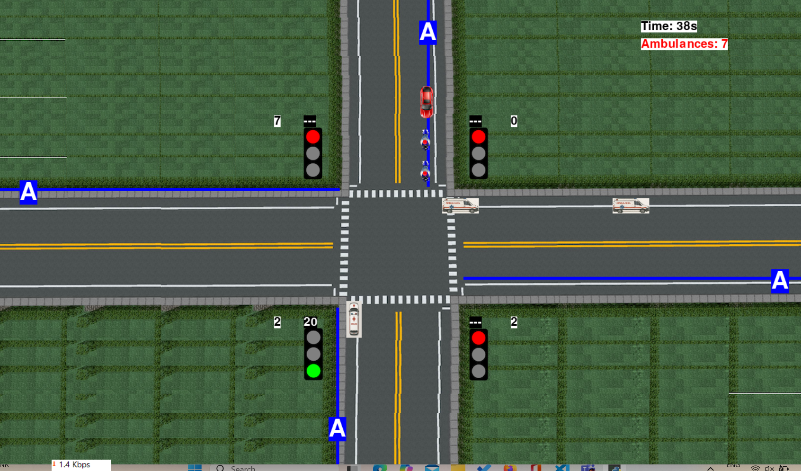

## AI-Based Traffic Management System 🚦
An intelligent traffic management system that uses computer vision and deep learning to optimize traffic flow, with special priority for emergency vehicles like ambulances.

## 🌟 Features

## 🚗 Smart Vehicle Detection
Real-time vehicle detection using YOLOv7

Multi-class vehicle classification (cars, buses, trucks, bikes, ambulances)

Accurate counting and tracking of vehicles

## 🚑 Emergency Vehicle Priority
Automatic ambulance detection and identification

Dynamic traffic signal adjustment for emergency vehicles

Audio-visual alerts for ambulance presence

Priority lane management

## 🎮 Interactive Simulation
Real-time traffic simulation with Pygame

Visual representation of traffic flow

Dynamic signal timing based on vehicle density

Emergency scenario simulation

## ⚡ Adaptive Traffic Control
AI-powered traffic signal optimization

Real-time adjustment of green light durations

Congestion detection and management

Smart lane allocation

## 📁 Project Structure
```
AI-based-Traffic-Management-System/
│
├── vehicle_detection.py          # YOLO-based vehicle detection
├── simulation_emergency.py       # Traffic simulation with emergency features
├── requirements.txt              # Project dependencies
│
├── images/                       # Vehicle assets for simulation
│   ├── right/
│   ├── left/
│   ├── up/
│   └── down/
│
├── sounds/                       # Audio files
│   └── ambulance.mp3            # Emergency siren sound
│
└── test_images/                  # Sample images for testing
    ├── 1.jpg
    ├── 2.jpg
    ├── 3.jpg
    └── 4.jpg
```
## Here are a few visual glimpses




